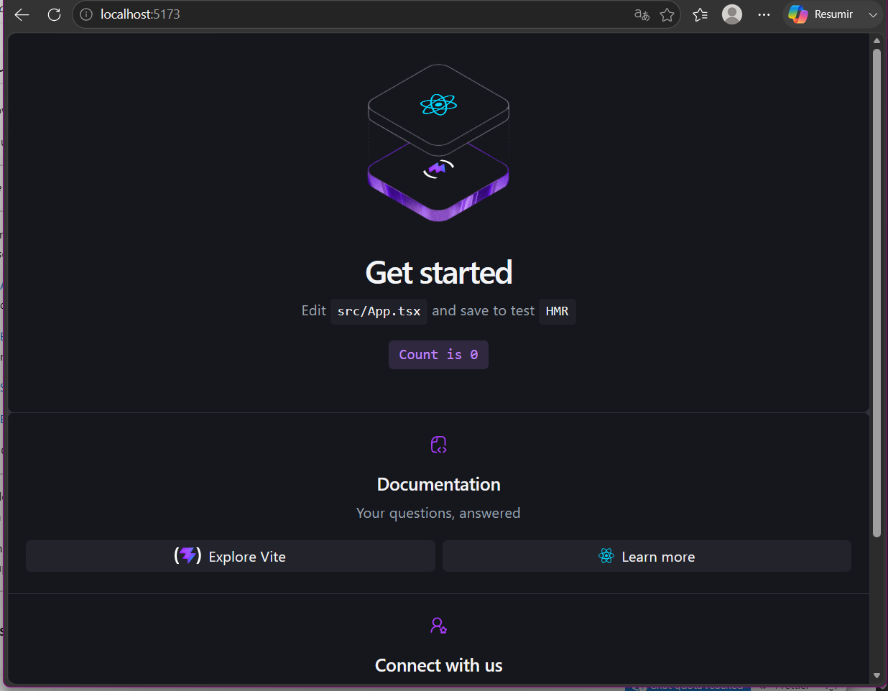
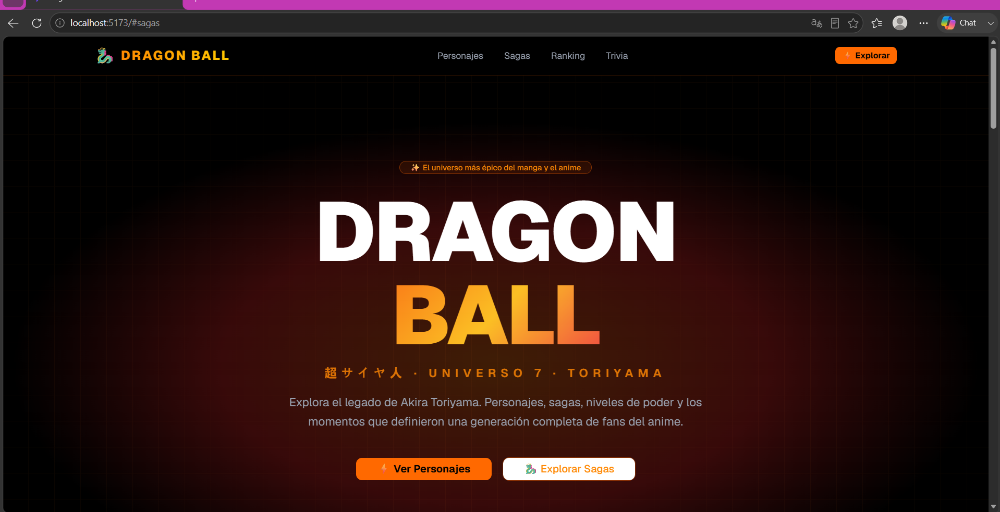
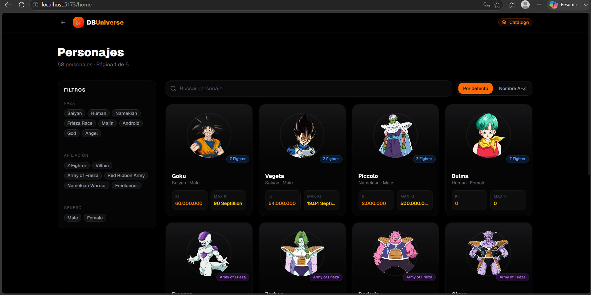
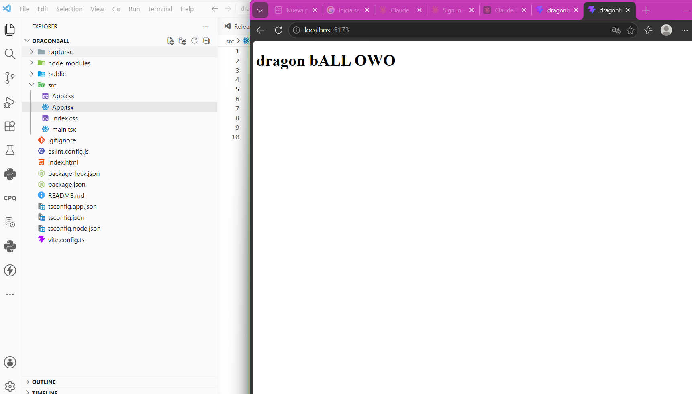
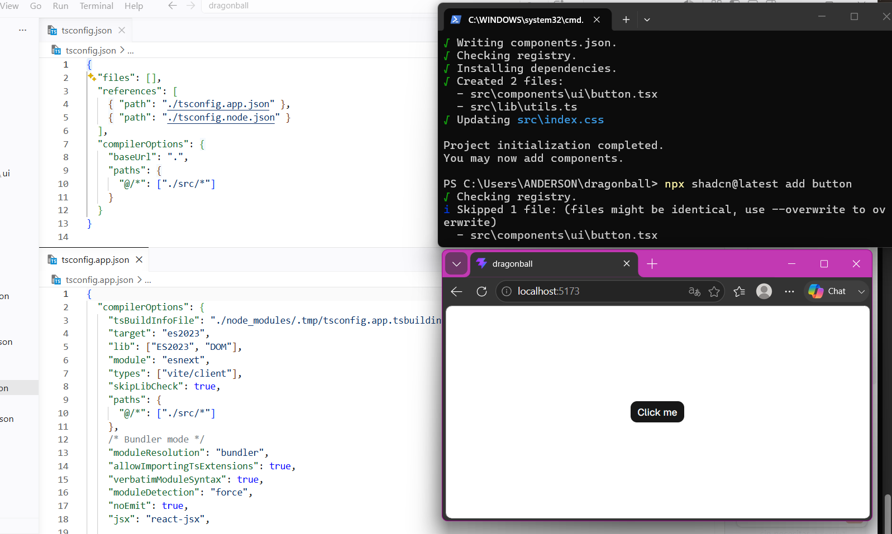
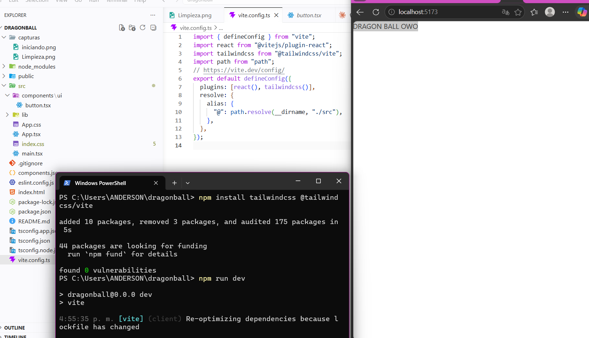

# Lab 13 - Trabajo Grupal

## Capturas del Proyecto

### Iniciando el proyecto



---

### Primera iteración



---

### Iteración 2



---

### Limpieza del proyecto



---

### Configuración de Shadcn



---

### Configuración de Tailwind



---

## Integrantes

- Anderson Jair Rivera Pucuhuayla
- Integrante 2
- Integrante 3

## Tecnologías Utilizadas

- React
- Vite
- Tailwind CSS
- Shadcn/UI
- Git
- GitHub

## Ejecución del Proyecto

```bash
npm install
npm run dev
```

## Repositorio

```bash
git clone <URL_DEL_REPOSITORIO>
cd lab13grupal
npm install
npm run dev
```
